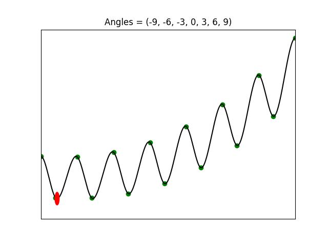

# Multi Mountains



## Install

```bash
git clone https://github.com/mhyrzt/MultiMountains.git
cd MultiMountains
pip install . -e
```

## Example

```python
from multi_mountains import MultiMountainsEnv

env = MultiMountainsEnv(
    angles=(-9, -6, -3, 0, 3, 6, 9), 
    max_step=7 * 200
)

state = env.reset()

while True:
    """
        A -> Left
        D -> Right
        O.W -> No Move
    """
    action = env.get_user_action()
    state, reward, done, _ = env.step(action)
    env.render()
    if done:
        break
```
